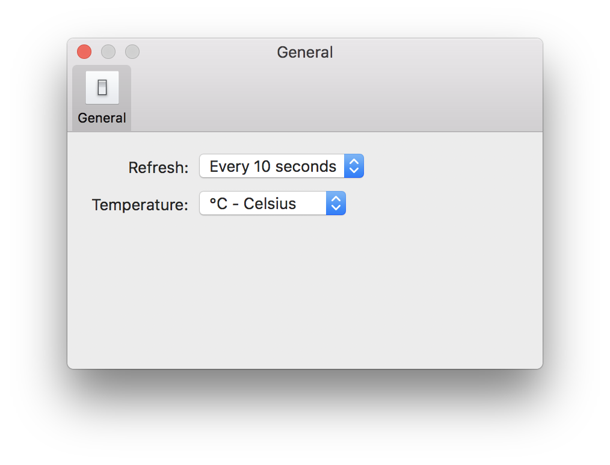

# Temperature on macOS

Tool used to show CPU temperature and fans' speed on Mac

## Supported Languages

* English

* Chinese

## Download

[Download](https://github.com/Gondnat/mac-temperature/releases)

## Screen Shot

